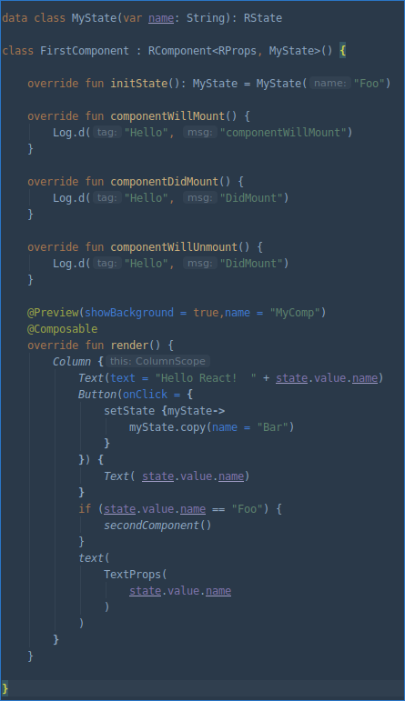
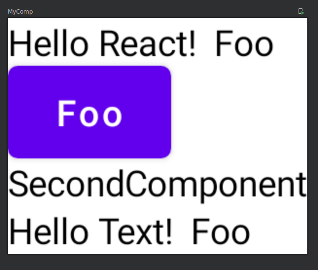

# ComposeReact

## Introduction 🙋‍♂️ 🙋‍
This is just for fun project where i tried to figure out, how Jetpack Compose could be used with API similar to React. The code is working so far, but i'm not really planning to go further with this approach.

Screenshots
-----------
[](docs/codelef.png)
[](docs/coderight.png)

## Usage
You need at least Compose 0.1.0-dev12

### Add dependency

```groovy
repositories {
    mavenCentral()
}

dependencies {
   implementation "de.jensklingenberg:composereact:0.1-0.12"
}
```

### Create a RComponent

1) Create a class that extends de.jensklingenberg.composereact.RComponent

```kotlin
class FirstComponent : RComponent<RProps, RState>() {
```

2) Implement the render() function and add the @Composable annotation

```kotlin
@Composable
override fun render() {
//Add your Composables and RComponents here
}
```

### Use a RComponent
To use your RComponent inside other Composables, create an object and call the start()-function

```kotlin
@Composable
override fun render() {
 Column{
   MyOtherComponent().start()
 }
}
```

Inside the setContent{} of your Activity/View, you can also use runApp()

```kotlin
setContent {
    runApp ( FirstComponent() )
}
```

### Define a State
Create a data class that extends RState

```kotlin
data class MyState(var name: String): RState
```

Add the class to your Component

```kotlin
class FirstComponent : RComponent<RProps, MyState>() {
```

Override the initState() and initialize your state 
```kotlin
override fun initState(): MyState = MyState("Foo")
```

You can then use state.value to get your state and set your state with setState()-function like this:
```kotlin
setState {myState->
myState.copy(name = "Bar")
}
```

### Define Props

Create a data class that extends RProps

```kotlin
data class MyProps(var name: String): RProps
```
Add the class to your Component

```kotlin
class FirstComponent(props: MyProps) : RComponent<MyProps, MyState>() {
```

Override the initState() and initialize your state 
```kotlin
 override fun initState(props: MyProps): MyState { 
        return MyState(text = props.text) }
```

### Lifecycle
You can override the following lifecycle methods:

* componentWillMount()

Will be called before the RComponent/Composable is drawn to screen.
 
* componentDidMount()

Will be called when the RComponent/Composable is drawn to screen.

 
* componentWillUnmount()
Will be called when the RComponent/Composable is going to be disposed

## 👷 Development Project Structure
 	
* <kbd>app</kbd> - An example project that is using ComposeReact
* <kbd>composereact</kbd> - The module with the code for ComposeReact

## 📜 License

This project is licensed under the Apache License, Version 2.0 - see the [LICENSE.md](https://github.com/Foso/ComposeReact/blob/master/LICENSE) file for details

-------

    Copyright 2020 Jens Klingenberg

    Licensed under the Apache License, Version 2.0 (the "License");
    you may not use this file except in compliance with the License.
    You may obtain a copy of the License at

       http://www.apache.org/licenses/LICENSE-2.0

    Unless required by applicable law or agreed to in writing, software
    distributed under the License is distributed on an "AS IS" BASIS,
    WITHOUT WARRANTIES OR CONDITIONS OF ANY KIND, either express or implied.
    See the License for the specific language governing permissions and
    limitations under the License.


